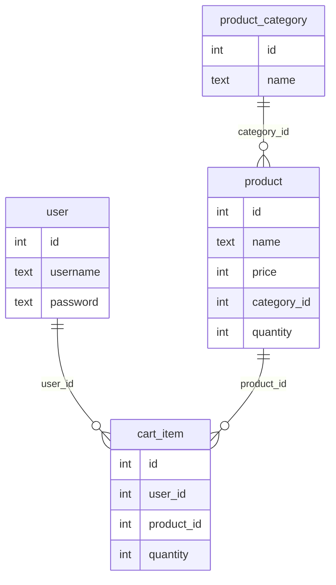

## Development tips

- Use the [Figma UI Design](https://www.figma.com/file/whrvrXtMIHRpJvpxzXicG7/CSC-256-Web-Application?type=design&node-id=0%3A1&mode=design&t=7MqtO2IybIFLZYLW-1) as a guide when implementing features
- Try your best to use Test Driven Development
  - Meaning, write tests for the features you're going to implement before writing the code for the features
- After implementing a feature, look through the RTM to make sure selenium tests for that feature will correctly pass
- If you're having trouble with HTML form validation see the MDN web docs on [Client-side form validation](https://developer.mozilla.org/en-US/docs/Learn/Forms/Form_validation)

## Overview

### SQL Tables:

### Pages:

#### Base html (on every page)

##### UI Elements

- Navbar with all links
  - Left side has 'Logo' text that links to home page
  - Right side has links that change if user is logged in:
    - Adds `/cart` and `/logout` links
    - Removes `/login` and `/register` links

#### Home Page - `/`

##### UI Elements

- Background image
- Heading text
- Button navigating to `/shop`

#### Shop Page - `/shop`

##### UI Elements

- Filter input on top
  - On change of value select products based on the category
- Grid of products selected from the database
  - Product has:
    - Image
    - Name
    - Price
  - Clicking on a product navigates to that products page (`/shop/{id}`)

#### Single Product page - `/shop/{id}`

- Selects the product from database using the `{id}`

##### UI Elements

- Product image
- Product name
- Product price
- Product description
- Add to cart button - adds product to cart then navigates to `/cart`

#### Cart page - `/cart`

##### UI Elements

- Heading saying "My Cart"
- List of products in cart
  - Each product list item has:
    - Product image
    - Product name
    - Product price
    - Remove button - deletes cart item from database
- Checkout button link - navigates to `/checkout`

#### Checkout page - `/checkout`

##### UI Elements

- Checkout information form:
  - Shipping Information section
    - Email text input
    - First & last name text input
    - Country select input
    - Address text input
  - Payment Details section
    - Card number text input - Minimum 16 numbers
    - Expiration date
      - Month select input
      - Year select input
    - Security code text input - Minimum 3 numbers
  - Pay button
    - Displays cart total as "Pay $100"
    - On click it submits the form

##### Functionality

- Show error messages for any input that is invalid / blank

#### Register - `/auth/register`

##### UI Elements

- Register form
  - Username text input
  - Password text input
  - Submit button

##### Functionality

- Show error messages when inputs are invalid / blank

#### Login - `/auth/login`

##### UI Elements

- Login form
  - Username text input - Can not be blank
  - Password text input - Can not be blank
  - Submit button

##### Functionality

- Show error messages when inputs are invalid / blank
- Show error message when username or password is incorrect (after form submission)
  - This error should come from the server response, then you can display it
